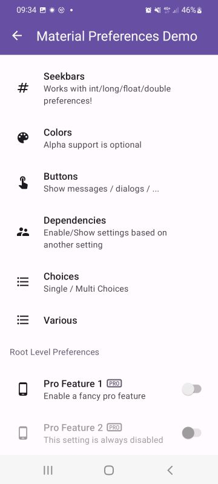
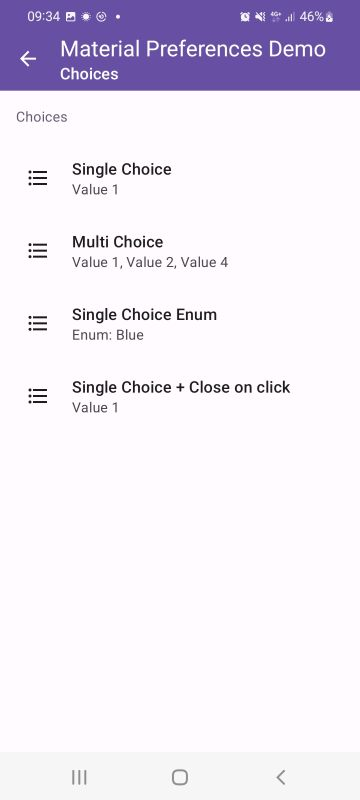
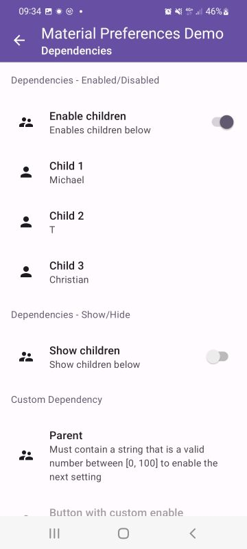

### About

[](https://jitpack.io/#MFlisar/MaterialPreferences)


### Introduction

This library is based on `Flows` and `Coroutines` and works with the provided *DataStore Storage* or even with a custom storage implementation.
It supports `LiveData` by default as `Flows` can easily be converted to `LiveData`. Preferences are elegantly declared via `delegates`.
Additionally the *preference-screen* module provides a DSL to easily set up `RecyclerView` based preference screens.
It also supports custom extensions for custom preference screens.

### Core

With this library you can declare preferences via kotlin `delegates`,and observe and update them via kotlin `Flows`. This works with any storage implementation, an implementation for JetPack DataStore is provided already.

##### 1/4 Define preferences:

```kotlin
object UserSettingsModel : SettingsModel(DataStoreStorage(name = "user")) {

  // Basic
  val name by stringPref("User")
  val alive by boolPref(true)
  val hairColor by intPref(Color.parseColor("#A52A2A"))
  val age by intPref(40)
  val income by floatPref(50000f)
  val dayOfBirth by longPref(0L)
  
  // Sets
  val childrenAges by intSetPref(setOf(20, 18, 16))
  val childrenIncomes by floatSetPref(setOf(30000f, 10000f, 0f))
  val childrenDaysOfBirth by longSetPref(setOf(0L, 0L, 0L))
  
  // Enum
  val car by enumPref(Car.Tesla)
  
  // custom class - provide a custom converter (String <=> Class)
  val testClass by anyPref(TestClass.CONVERTER, TestClass())
}
```

##### 2/4 Observe/Read preferences:

```kotlin
// 1) simply observe a setting
UserSettingsModel.name.observe(lifecycleScope) {
	L.d { "name = $it"}
}

// 2) direct read (not recommended if not necessary but may be useful in many cases => simply returns flow.first() in a blocking way)
val name = UserSettingsModel.name.value

// 3) observe a setting once
UserSettingsModel.name.observeOnce(lifecycleScope) {
	L.d { "name = $it"}
}

// 4) observe ALL settings
UserSettingsModel.changes.onEach {
	L.d { "[ALL SETTINGS OBSERVER] Setting '${it.setting.key}' changed its value to ${it.value}" }
}.launchIn(lifecycleScope)

// 5) observe SOME settings
UserSettingsModel.changes´
	.filter {
		it.setting == UserSettingsModel.name ||
		it.setting == UserSettingsModel.age
	}.onEach {
		// we know that either the name or the age changes
		L.d { "[SOME SETTINGS OBSERVER] Setting '${it.setting.key}' changed its value to ${it.value}" }
	}.launchIn(lifecycleScope)
	
// 6) read multiple settings in a suspending way
lifecycleScope.launch(Dispatchers.IO) {
  val name = UserSettingsModel.childName1.flow.first()
  val alive = DemoSettingsModel.alive.flow.first()
  val hairColor = DemoSettingsModel.hairColor.flow.first()
  withContext(Dispatchers.Main) {
	textView.text = "Informations: $name, $alive, $hairColor"
  }
}
```

##### 3/4 Lifedata:

```kotlin
val lifedata = UserSettingsModel.name.flow.asLiveData()
```

##### 4/4 Update preferences:

```kotlin
lifecycleScope.launch(Dispatchers.IO)  {
  UserSettingsModel.name.update("Some new name")
  UserSettingsModel.age.update(30)
}
```

### Storage

The `Storage` is an abstraction to support any storage implementation. The `datastore` module provides an implementation based on the [Android JetPack DataStore](https://developer.android.com/topic/libraries/architecture/datastore).

Check out the corresponding readme here: [DataStore Module README](README-DATASTORE.md)

### Preference Screen

The *preference-screen&ast;* modules allow you to create preference screens like following easily via DSL.






Explanations, code examples and more be found here: [Preference Screen Modules README](README-PREFERENCE-SCREEN.md)


### Gradle (via [JitPack.io](https://jitpack.io/))

1. add jitpack to your project's `build.gradle`:
```groovy
repositories {
    maven { url "https://jitpack.io" }
}
```
2. add the compile statement to your module's `build.gradle`:
```groovy
dependencies {

  // core module
  implementation "com.github.MFlisar.MaterialPreferences:core:<LATEST-VERSION>"

  // data store module
  implementation "com.github.MFlisar.MaterialPreferences:datastore:<LATEST-VERSION>"
    
  // screen modules
  implementation "com.github.MFlisar.MaterialPreferences:screen:<LATEST-VERSION>"
  implementation "com.github.MFlisar.MaterialPreferences:screen-input:<LATEST-VERSION>"
  implementation "com.github.MFlisar.MaterialPreferences:screen-choice:<LATEST-VERSION>"
  implementation "com.github.MFlisar.MaterialPreferences:screen-color:<LATEST-VERSION>"
}
```

TODO

- [ ] Preference Types
	- [ ] SeekBar Preference
	- [ ] Collapse Preference - add sub items ONCE on click
	- [ ] Dropdown Preference
	- [ ] Spacer Preference
- [ ] Others
  - [ ] Global Setting - enable title numbering (Count numbers of categories yes/no)
  - [ ] use [MaterialDialogFragments](https://github.com/MFlisar/MaterialDialogFragments) dialog fragments so that even the dialogs restore their state and remember temporary user changes inside the dialogs